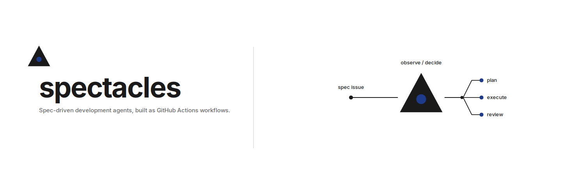

<a href="https://norrietaylor.github.io/spectacles/">
<picture>
<source media="(prefers-color-scheme: dark)" srcset="docs/assets/png/banner-dark.png">
<source media="(prefers-color-scheme: light)" srcset="docs/assets/png/banner-light.png">

</picture>
</a>

**[Documentation](https://norrietaylor.github.io/spectacles/)**

Spec-driven development as agentic GitHub Actions workflows.

`spectacles` is a suite of agentic workflows (built on
[gh-aw](https://github.com/githubnext/gh-aw)) that move a feature from a plain
GitHub issue to a merged implementation through a disciplined pipeline:
**spec then architecture then triage then execute then validate then review**.
The whole pipeline is operated through GitHub primitives only: issues,
comments, labels, and pull requests. There is no separate tool and no UI.

## Pipeline

| Stage | Agent | Output |
|---|---|---|
| Spec | `sdd-spec` | a structured spec, delivered as a PR |
| Architecture and triage | `sdd-triage` | an architecture record, then a task graph of linked sub-issues |
| Dispatch | `sdd-dispatch` | event-driven fan-out of ready tasks to `sdd-execute`, re-fired on every task close until the tree drains |
| Execute | `sdd-execute` | an implementation PR with captured proof artifacts |
| Validate | `sdd-validate` | advisory gate findings at every phase boundary |
| Review | `sdd-review` | correctness, security, and spec-compliance review comments |

`needs-human` is the single agent-to-human hand-off label: an agent applies it
when it cannot safely proceed, and a human clears it to resume the pipeline.
See [`decisions/0001-needs-human.md`](decisions/0001-needs-human.md).

## Status

The suite is built. The repository foundation, the human-interaction
contract, the shared MCP tooling, and all six pipeline agents are in place;
the [issue-native SDD spec](docs/specs/01-spec-issue-native-sdd/01-spec-issue-native-sdd.md)
defines the full design across ten demoable units. The first live pipeline
run is an operator acceptance step: see the
[install guide](docs/sdd/install.md) and
[`decisions/0003-bootstrapping-policy.md`](decisions/0003-bootstrapping-policy.md).

## Install

`spectacles` installs onto a consumer repo, including one with an existing
codebase, with `scripts/quick-setup.sh --suite sdd`. See the
[install guide](docs/sdd/install.md) for the steps, the required
configuration, and a post-install smoke test, and
[`workflows/README.md`](workflows/README.md) for the reusable-workflow plus
thin-wrapper distribution model.

## License

MIT. See [`LICENSE`](LICENSE).
