# The SDD pipeline

This page is the team member's guide to the spectacles spec-driven development
(SDD) pipeline: how a plain GitHub issue becomes a merged implementation, and
what a human does at each step.

The pipeline runs as a set of agentic GitHub Actions workflows. You operate it
entirely through GitHub primitives you already use: opening an issue, applying
a label, writing a comment, and reviewing and merging a pull request. There is
no new tool to install and no separate task board.

## The agents

| Agent | Turns | Into |
|---|---|---|
| `sdd-spec` | a tracking issue | full path: a structured spec, delivered as a PR. Single-PR (agile/fast) path: a stub or light spec PR plus a single execution-plan comment on the tracking issue (ADR 0012, ADR 0024) |
| `sdd-triage` | a merged spec | an architecture record, then a task graph of sub-issues |
| `sdd-dispatch` | `/dispatch` on a tracking issue, or a task sub-issue closing | fan-out of ready tasks to `sdd-execute` variants, bounded by `max-parallel` (noop on fast-path issues) |
| `sdd-execute` | a ready task sub-issue, or a fast-path tracking issue on `/approve` | an implementation PR with proof artifacts |
| `sdd-validate` | a phase-boundary artifact | advisory findings posted as a comment |
| `sdd-review` | an implementation PR | code-review comments on correctness, security, and spec compliance |
| `sdd-derive` | a pull request that shipped with no spec | a spec authored retrospectively from the code, delivered as a `spec/<slug>` documentation PR with a gap analysis (ADR 0027) |

Lifecycle labels on the tracking issue: `sdd:spec`, `sdd:fastpath`,
`sdd:fastpath-review`, `sdd:triage`, `sdd:ready`, `sdd:in-progress`,
`sdd:review`, `sdd:done`. The `sdd:fastpath` and `sdd:fastpath-review`
labels mark the fast-path states (ADR 0012); a fast-path tracking issue
never carries `sdd:triage`, `sdd:ready`, or `sdd:review`.

`sdd-triage` runs three phases under one workflow: architecture design, a
plan-comment proposal on the tracking issue, and — on `/approve` — the
creation of the Unit and task sub-issue tree (ADR 0010). A demoable unit that
groups two or more tasks becomes a Unit sub-issue; a unit that holds a single
task collapses to a task parented directly to the feature (Feature → task), so
no Unit sub-issue is created for it (ADR 0028). Structure is only created after
`/approve`: until then the plan is a proposal, not a tree.

`sdd-dispatch` is the cascade orchestrator. On `/dispatch` it computes the
ready set from the dependency graph and fans out to `sdd-execute` variants
in a bounded matrix; it then re-fires on every task close until the tree
is drained. Execution is fully event-driven (ADR 0011): there is no daily
cron.

`sdd-spec` has two modes: full-path (the default) and the single-PR
(agile/fast) path. On
intake it classifies the work against the single-PR criteria (ADR 0024,
widening ADR 0012): estimated net diff at or under `SDD_AGILE_MAX`
(default 800), no new external dependency, no schema/data-format
migration, no cross-cutting boundary change, no ADR-worthy decision.
When all pass, it
posts a proposal asking the human to comment `/agile` (or `/fastpath`)
to confirm or
`/spec` to keep the full flow. On confirmation it produces a
spec PR — a compressed stub for trivial work, a light spec (multiple
units, full R-IDs, optional Design notes) for anything larger — plus a
single execution-plan comment on the
tracking issue; one `/approve` then dispatches the implementation:
typed after the spec PR merges it dispatches directly, typed while the
spec PR is still open it records the `sdd:approved` marker — and, when
the consumer sets `SDD_AUTO_MERGE`, also arms squash auto-merge —
so the merge dispatches (merge and approve commute; with
`SDD_AUTO_MERGE` unset the human merges the spec PR by hand and the
merge still dispatches).
Two extra lifecycle labels —
`sdd:fastpath` and `sdd:fastpath-review` — mark the single-PR states.
`/dispatch` is a noop on a single-PR tracking issue (the fan-out is
unused).

## End-to-end flow

The steps below trace one feature from idea to close. The lifecycle label on
the tracking issue, listed in the right-hand column, tells you where the
feature is at any moment.

The diagram traces that path end to end. Amber-bordered nodes are the steps a
human takes; blue-bordered nodes are automated agent runs; the red-bordered
node is a `needs-human` hand-off, which any agent can raise and only a human
clears. Dotted edges run
backward: a `/revise` comment sends a pull request back to its agent for
changes, and clearing `needs-human` resumes a stalled hand-off.

```mermaid
flowchart TD
    classDef human stroke:#e0a82e,stroke-width:4px;
    classDef agent stroke:#4493f8,stroke-width:4px;
    classDef handoff stroke:#f85149,stroke-width:4px;

    open([Human: open a feature or bug issue<br/>the template applies sdd:spec]):::human

    subgraph s_spec [Tracking issue state: sdd:spec]
        a_classify[sdd-spec classifies the issue<br/>full path: draft a spec<br/>single-PR path: post an /agile proposal]:::agent
        a_spec[sdd-spec drafts the spec<br/>opens a spec sub-issue and a spec PR]:::agent
        h_spec([Human: review and merge the spec PR<br/>the spec sub-issue closes on merge]):::human
    end

    subgraph s_fast [Single-PR path: sdd:fastpath then sdd:fastpath-review]
        h_fast([Human: comment /agile or /fastpath]):::human
        a_fast[sdd-spec: stub or light spec PR + execution plan comment]:::agent
        h_fast_merge([Human: review and merge the spec PR<br/>or /approve first: sdd:approved arms auto-merge<br/>and the merge dispatches - either order works]):::human
        h_approve_fast([Human: comment /approve]):::human
    end

    subgraph s_triage [Tracking issue state: sdd:triage]
        h_triage([Human: comment /triage]):::human
        a_arch[sdd-triage phase A: maps the code, builds the<br/>assumption ledger, opens an architecture sub-issue and PR]:::agent
        h_arch([Human: review and merge the architecture PR<br/>the architecture sub-issue closes on merge]):::human
        a_spikewave[sdd-triage phase A step 4a: one kind:spike<br/>sub-issue per needs-spike assumption]:::agent
        a_actuator[sdd-spike-actuator: posts /execute<br/>on each kind:spike sub-issue]:::agent
        a_spikedoc[sdd-execute: writes docs/spikes/&lt;date&gt;-&lt;slug&gt;.md<br/>opens a spike doc PR]:::agent
        a_spikeval[sdd-validate spike boundary:<br/>proved, disproved, or partial]:::agent
        a_reentry[sdd-spike-reentry: when the wave drains to<br/>zero open spikes, re-enters phase B]:::agent
        a_units[sdd-triage phase B: posts the proposed plan<br/>as one comment on the tracking issue]:::agent
        h_approve([Human: comment /approve]):::human
    end

    subgraph s_ready [Tracking issue state: sdd:ready]
        a_tasks[sdd-triage phase C: creates Unit sub-issues for multi-task units<br/>and task sub-issues, collapsing a single-task unit to a feature-parented task;<br/>labels unblocked tasks sdd:ready]:::agent
        a_cycle[sdd-cycle-detect: deterministic DAG backstop<br/>parks needs-human on a cycle the LLM missed]:::agent
    end

    subgraph s_dispatch [Tracking issue state: sdd:ready, awaiting /dispatch]
        h_dispatch([Human: comment /dispatch on the tracking issue<br/>or automatic with SDD_AUTO_DISPATCH=1]):::human
        a_dispatch[sdd-dispatch computes the ready set and fans out to<br/>sdd-execute variants, bounded by max-parallel<br/>re-fires on every task close until the tree drains]:::agent
    end

    subgraph s_progress [Tracking issue state: sdd:in-progress, sdd:dispatched]
        a_exec[sdd-execute implements a ready task, opens an<br/>implementation PR with proof artifacts<br/>runs on workflow_dispatch from sdd-dispatch, or on /execute]:::agent
    end

    subgraph s_review [Tracking issue state: sdd:review]
        a_check[sdd-validate posts advisory findings<br/>sdd-review posts code-review comments]:::agent
        h_merge([Human: review and merge the implementation PR<br/>the task sub-issue closes on merge]):::human
    end

    subgraph s_done [Tracking issue state: sdd:done]
        a_done[Every task closes its Unit sub-issue; once all<br/>Units close, sdd-execute sets sdd:done + needs-human]:::agent
        h_close([Human: final review, then close the tracking issue]):::human
    end

    open --> a_classify
    a_classify -->|full path| a_spec --> h_spec --> h_triage --> a_arch --> h_arch
    a_classify -->|single-PR proposal| h_fast
    h_fast --> a_fast --> h_fast_merge --> h_approve_fast --> a_exec
    h_fast_merge -->|approved before merge: merge dispatches| a_exec
    h_arch -->|needs-spike residue: pre-plan spike wave| a_spikewave
    a_spikewave --> a_actuator --> a_spikedoc --> a_spikeval
    a_spikeval -->|proved: sdd:spike-resolved on the spike sub-issue| a_reentry
    a_spikeval -.->|disproved or partial: park the tracking issue| hand
    a_reentry --> a_units
    h_arch -->|ledger all settled: no wave| a_units
    a_units --> h_approve --> a_tasks --> a_cycle --> h_dispatch
    a_cycle -.->|cycle the LLM missed: park needs-human| hand
    h_dispatch --> a_dispatch --> a_exec --> a_check --> h_merge
    h_merge -->|tasks remain, full path| a_dispatch
    h_merge -->|last task done, or fast path| a_done --> h_close

    hand[/"Any agent, on low confidence or a blocker:<br/>posts questions, applies needs-human, stops"/]:::handoff
    ans([Human: answer the questions, remove needs-human<br/>the agent re-runs and resumes]):::human
    a_classify -.-> hand
    a_spec -.-> hand
    a_fast -.-> hand
    a_arch -.-> hand
    a_tasks -.-> hand
    a_exec -.-> hand
    hand --> ans

    h_spec -.->|changes needed? comment /revise| a_spec
    h_arch -.->|changes needed? comment /revise| a_arch
    h_merge -.->|changes needed? /revise or a review comment| a_exec
```

| Step | Who acts | What happens | Lifecycle label |
|---|---|---|---|
| 1. Open the issue | you | Open an issue from the `feature` or `bug` template. The template applies `sdd:spec`, which triggers `sdd-spec`. | `sdd:spec` |
| 2. Review the spec PR | you | `sdd-spec` drafts a spec and opens it as a PR. Read it, comment, and merge when it is right. Merging advances the pipeline. | `sdd:spec` |
| 3. Start triage | you | Comment `/triage` on the tracking issue. `sdd-triage` phase A maps the code and opens an architecture PR. | `sdd:triage` |
| 4. Review the architecture PR | you | Read the architecture record, comment, and merge it. Merging triggers phase B. | `sdd:triage` |
| 5. Approve the plan | you | `sdd-triage` posts the proposed plan as a comment on the tracking issue. Comment `/approve` to materialize it, or `/revise <note>` to amend. | `sdd:triage` |
| 6. Tree is created | `sdd-triage` | Phase C creates Unit sub-issues and sub-task issues together, each with its scope, proof artifacts, and a `model:*` tier label. | `sdd:ready` |
| 6a. Dispatch the plan | you | Comment `/dispatch` on the tracking issue — or set `SDD_AUTO_DISPATCH=1` and phase C completion arms the cascade automatically (ADR 0025; `/dispatch` stays the manual command and, via `sdd:dispatched`, the pause/resume control). `sdd-dispatch` arms the cascade: it computes the ready set from the dependency graph, fans out `sdd-execute` runs in a bounded matrix (`SDD_DISPATCH_MAX_PARALLEL`, default 5), and re-fires on every task close until the tree is drained. | `sdd:in-progress` |
| 7. Tasks are implemented | `sdd-execute` | Each dispatched task: `sdd-execute` picks it up via `workflow_dispatch` from the cascade and opens an implementation PR. A human may also comment `/execute` on a task to run it immediately, outside the cascade. | `sdd:in-progress` |
| 8. Validation runs | `sdd-validate` | At each phase boundary, `sdd-validate` posts advisory findings as a comment. A clean implementation pass moves the issue to `sdd:review`. | `sdd:review` |
| 9. Code review runs | `sdd-review` | `sdd-review` posts review comments on the implementation PR. You read them and decide. | `sdd:review` |
| 10. Merge and close | you | Merge the implementation PRs. When every task sub-issue is closed, the issue moves to `sdd:done` and `needs-human` is applied for your final review and close. | `sdd:done` |

Structure is only created after `/approve`. Until then the plan lives as a
single comment on the tracking issue, so a `/revise <note>` is cheap:
`sdd-triage` re-posts the plan with the note applied and there is no tree
to garbage-collect. ADR 0010 records the gate semantics.

### Single-PR (agile) path steps

The single-PR flow (ADR 0012, generalized by ADR 0024) compresses
spec, architecture, and plan
into one agent run for work that fits in one implementation PR. The
steps below run in
place of the full table above when the tracking issue's lifecycle
forks off to `sdd:fastpath` after `/agile` or `/fastpath`.

| Step | Who acts | What happens | Lifecycle label |
|---|---|---|---|
| 1. Open the issue | you | Open from the `feature` or `bug` template (same as the full path). | `sdd:spec` |
| 2. Classify | `sdd-spec` | The agent reads the issue, checks the single-PR criteria (estimated diff ≤ `SDD_AGILE_MAX`, no new external dependency, no schema/data-format migration, no cross-cutting boundary change, no ADR-worthy decision), and posts one proposal comment asking for `/agile` (or `/fastpath`) or `/spec` (full flow). Silence means the full flow runs. | `sdd:spec` |
| 3. Confirm the single-PR path | you | Comment `/agile` (or `/fastpath`) on the tracking issue. The wrapper moves the lifecycle to `sdd:fastpath` and re-invokes `sdd-spec`. | `sdd:fastpath` |
| 4. Author the spec | `sdd-spec` | One run produces a spec PR — a stub (problem statement, R-IDs, proof artifacts, one Unit) for trivial work, a light spec (multiple units, full R-IDs, 1–3 proof artifacts per unit, optional Design notes) otherwise — and an execution plan comment on the tracking issue naming one task that spans the feature. | `sdd:fastpath-review` |
| 5. Merge the spec PR | you | Review and merge. The spec sub-issue closes via the existing `Closes` keyword. Or comment `/approve` first: the approval is recorded as the `sdd:approved` marker, squash auto-merge is armed (with `SDD_AUTO_MERGE`), and the merge dispatches — merge and approve commute (ADR 0024). | `sdd:fastpath` |
| 6. Approve and dispatch | you | Comment `/approve` on the tracking issue (skip if you approved in step 5 — the merge already dispatched). The `sdd-spec` wrapper finds the plan comment, parses the `model:*` tier, and dispatches one `sdd-execute-{tier}` against the plan. No Unit or task sub-issues are created. | `sdd:in-progress` |
| 7. Implementation runs | `sdd-execute` | The variant opens one implementation PR with proof artifacts. `sdd-validate` and `sdd-review` run as on the full path; the absence of an architecture record and a sub-task tree is not a finding. | `sdd:in-progress` |
| 8. Merge and close | you | Merge the implementation PR. `sdd-execute` moves the tracking issue to `sdd:done` and applies `needs-human` for your final close. | `sdd:done` |

`/dispatch` on a single-PR tracking issue is a noop with a one-comment
explanation pointing to `/approve`. A `/revise <note>` between the
execution plan comment and the dispatch edits the plan in place (a new
plan comment is posted; the prior one is hidden as `OUTDATED`). A
`/revise` after an early `/approve` clears the `sdd:approved` marker —
the plan changed, so re-approval is required — and a spec PR closed
without merging clears it too.

If during execution `sdd-execute` finds the work is materially bigger
than the classification assumed, it posts one comment naming the
mismatch and
applies `needs-human`. Your recourse is the standard `needs-human`
flow: answer in a comment and either tighten the scope (the executor
resumes) or comment `/spec` to bounce the issue into the full
pipeline (`sdd:fastpath` becomes `sdd:spec`; the existing spec is the
starting point of a fuller spec).

## Retrospective specs

The forward pipeline assumes a spec exists before code. Code explored directly
on a feature branch — opened with no tracking issue — ships without one.
`sdd-derive` (ADR 0027) is the reverse path: it reads a pull request and authors
a spec from the implemented code.

There are two ways in. When a pull request opens or updates without SDD lineage
(no `sdd/` head branch, no `Closes` link) and its diff is over the
`SDD_SPEC_MIN_UNIT` floor (default 400), a deterministic check posts one offer
comment and a `needs-spec` marker. Comment `/derive-spec` on that pull request
to take the offer; ignore it to defer. Separately, the `sdd-unspecced-scan`
workflow runs weekly and upserts one roll-up issue listing every unspecced
merged pull request; a maintainer comments `/derive-spec #12 #34` there to
derive a set at once.

Either way, `sdd-derive` opens a separate `spec/<slug>` documentation pull
request adding the spec under `docs/specs/`, and comments the link on the source
pull request. The derived spec carries a **Gap Analysis** section recording what
the code did not do — implementation gaps, missing failure paths, weak
acceptance criteria, and skipped demoable units. Those gaps stay in the spec for
a human to triage; `sdd-derive` opens no follow-up issues. A derived spec's
`tracking-issue` is blank, so `sdd-doc-status` leaves it at `planned` until a
human links one.

## Planning hardening

Two backstops keep the plan honest before and after `/approve`. Both run inside
the `sdd:triage` phase and need no extra human action in the normal case.

**The pre-plan spike wave.** While `sdd-triage` phase A designs the
architecture, it builds an **assumption ledger** in the architecture record: one
row per load-bearing assumption the chosen approach rests on. An assumption that
is load-bearing **and** not settleable from the repository working tree nor from
prior precedent is the residue — it is marked `needs-spike`. Phase A step 4a
then materializes one `kind:spike` sub-issue per `needs-spike` row, each a direct
child of the tracking issue. The `sdd-spike-actuator` wrapper posts `/execute` on
each spike, `sdd-execute` writes a `docs/spikes/<date>-<slug>.md` finding, and
`sdd-validate` resolves the outcome: a `proved` spike gains
`sdd:spike-resolved`; a `disproved` or `partial` spike parks the tracking issue
at `needs-human` so a human decides how the plan adapts. Phase B holds the plan
comment while any spike is open; the `sdd-spike-reentry` wrapper re-enters
phase B once the wave drains to zero open spikes, folding each resolved spike's
finding into the plan as settled ground. The spike wave is the one
materialization phase A performs — ADR 0010's all-or-nothing guarantee is scoped
to the main Unit/task tree, and the spike wave is the carved-out exception. See
[Spikes](spikes.md) for the full primitive.

**The cycle-detect backstop.** Phase B's plan composition runs a **latent-edge
pass**: a task whose proof artifacts consume an artifact a sibling task produces
is dependent on that producer even when no `blocked by` line was written, so the
implied edge is added to the plan and materialized verbatim by phase C. The
agent also checks the implied dependency graph for cycles before it posts. As a
deterministic backstop for a cycle the LLM misses, the `sdd-triage` wrapper runs
an `sdd-cycle-detect` composite-action job **after** phase-C materialization: it
walks the Feature → Unit → task sub-issues — including a task parented directly
to the feature when its Unit collapsed to one task (ADR 0028) — and if it finds
a real cycle (or a
`blocked by` reference it cannot resolve in the tree) it parks the tracking issue
at `needs-human` with a comment naming the cycle. The agent's in-prompt check is
the primary guarantee; this job is the authoritative backstop.

## What a human does

Across the whole pipeline a human takes only four kinds of action:

- **Open an issue** from the `feature` or `bug` template to start a feature.
  When you already have a Claude plan document, open from the
  **Specification (from Claude plan)** template (`spec.md`) and paste the plan
  into the body instead. That template applies a `plan:provided` marker, which
  puts the pipeline into translation mode: `sdd-spec` translates the plan into a
  structured spec rather than authoring one from a slim description, and
  `sdd-triage` translates the plan's architecture section into the architecture
  record. The marker clears once the architecture PR opens (or, on the fast
  path, the stub spec PR).
- **Comment a command** to steer: `/spec`, `/fastpath` (or its alias
  `/agile`), `/triage`,
  `/approve`, `/dispatch`, `/revise`, or `/execute`. See the command
  table in `shared/sdd-interaction.md`.
- **Review and merge PRs.** Merging a PR is the approval signal that advances
  the pipeline. No agent merges a PR; merge authority stays with humans and
  consumer CI.
- **Answer `needs-human`.** When an agent cannot safely proceed, it applies
  the `needs-human` label and posts one comment with the blocker. Answer in a
  comment and clear the label; the agent re-reads the thread and resumes. See
  ADR 0001 (`decisions/0001-needs-human.md` in the repository root).

## Giving feedback on a pull request

Every pull request the pipeline opens can be sent back for changes instead of
merged. Feedback never opens a second pull request; the owning agent updates
the existing one.

- **A spec PR or an architecture PR.** Comment `/revise <note>` on the pull
  request. The owning agent — `sdd-spec` or `sdd-triage` — re-runs with the
  note as an added instruction and updates the same pull request. Repeat until
  it is right, then merge.
- **An implementation PR.** Leave an inline review comment on the diff, or
  comment `/revise <note>` on the pull request. `sdd-execute` pushes follow-up
  commits to the same branch addressing it. A comment that needs a human
  decision is escalated through `needs-human` instead.

## Where state lives

- **The spec and the architecture record** are committed files, reviewed and
  merged as PRs and rendered into this docs site.
- **Tasks** are GitHub sub-issues linked to the tracking issue.
- **Lifecycle** is a single `sdd:*` label on the tracking issue.
- **Every human decision point** is an issue or PR comment.

Validation is advisory by design. `sdd-validate` posts findings and escalates
blockers through `needs-human`, but it is never a required status check and
never blocks a merge. Human review plus consumer CI is the only merge gate.

## Verification

- Open a test issue from the `feature` template and confirm it carries both
  the `kind:feature` and `sdd:spec` labels.
- Confirm `templates/.github/labels.yml` defines all eight `sdd:*` lifecycle
  labels, the `sdd:dispatched`, `sdd:approved`, `plan:provided`, and
  `sdd:spike-resolved`
  markers, the `kind:spike` label, and all three `model:*` tier labels.
- Confirm `shared/sdd-interaction.md` states the lifecycle state machine, the
  command table, and the `needs-human` contract, and references
  `decisions/0001-needs-human.md`.
