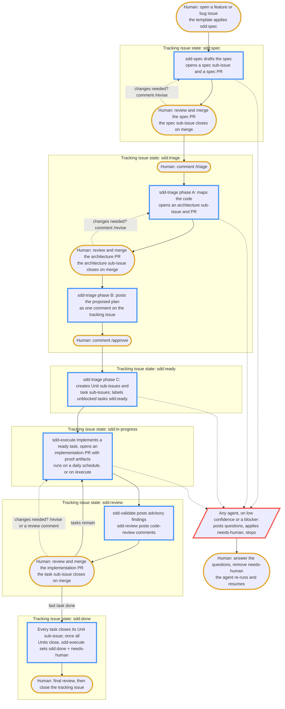

# The SDD pipeline

This page is the team member's guide to the spectacles spec-driven development
(SDD) pipeline: how a plain GitHub issue becomes a merged implementation, and
what a human does at each step.

The pipeline runs as a set of agentic GitHub Actions workflows. You operate it
entirely through GitHub primitives you already use: opening an issue, applying
a label, writing a comment, and reviewing and merging a pull request. There is
no new tool to install and no separate task board.

## The five agents

| Agent | Turns | Into |
|---|---|---|
| `sdd-spec` | a tracking issue | a structured spec, delivered as a PR |
| `sdd-triage` | a merged spec | an architecture record, then a task graph of sub-issues |
| `sdd-execute` | a ready task sub-issue | an implementation PR with proof artifacts |
| `sdd-validate` | a phase-boundary artifact | advisory findings posted as a comment |
| `sdd-review` | an implementation PR | code-review comments on correctness, security, and spec compliance |

`sdd-triage` runs three phases under one workflow: architecture design, a
plan-comment proposal on the tracking issue, and — on `/approve` — the
creation of the Unit and task sub-issue tree (ADR 0010). Structure is only
created after `/approve`: until then the plan is a proposal, not a tree.

## End-to-end flow

The steps below trace one feature from idea to close. The lifecycle label on
the tracking issue, listed in the right-hand column, tells you where the
feature is at any moment.

The diagram traces that path end to end. Amber-bordered nodes are the steps a
human takes; blue-bordered nodes are automated agent runs; the red-bordered
node is a `needs-human` hand-off, which any agent can raise and only a human
clears. Dotted edges run
backward: a `/revise` comment sends a pull request back to its agent for
changes, and clearing `needs-human` resumes a stalled hand-off.

| Step | Who acts | What happens | Lifecycle label |
|---|---|---|---|
| 1. Open the issue | you | Open an issue from the `feature` or `bug` template. The template applies `sdd:spec`, which triggers `sdd-spec`. | `sdd:spec` |
| 2. Review the spec PR | you | `sdd-spec` drafts a spec and opens it as a PR. Read it, comment, and merge when it is right. Merging advances the pipeline. | `sdd:spec` |
| 3. Start triage | you | Comment `/triage` on the tracking issue. `sdd-triage` phase A maps the code and opens an architecture PR. | `sdd:triage` |
| 4. Review the architecture PR | you | Read the architecture record, comment, and merge it. Merging triggers phase B. | `sdd:triage` |
| 5. Approve the plan | you | `sdd-triage` posts the proposed plan as a comment on the tracking issue. Comment `/approve` to materialize it, or `/revise <note>` to amend. | `sdd:triage` |
| 6. Tree is created | `sdd-triage` | Phase C creates Unit sub-issues and sub-task issues together, each with its scope, proof artifacts, and a `model:*` tier label. | `sdd:ready` |
| 7. Tasks are implemented | `sdd-execute` | On a daily schedule, or on `/execute`, `sdd-execute` picks up a ready task and opens an implementation PR. | `sdd:in-progress` |
| 8. Validation runs | `sdd-validate` | At each phase boundary, `sdd-validate` posts advisory findings as a comment. A clean implementation pass moves the issue to `sdd:review`. | `sdd:review` |
| 9. Code review runs | `sdd-review` | `sdd-review` posts review comments on the implementation PR. You read them and decide. | `sdd:review` |
| 10. Merge and close | you | Merge the implementation PRs. When every task sub-issue is closed, the issue moves to `sdd:done` and `needs-human` is applied for your final review and close. | `sdd:done` |

Structure is only created after `/approve`. Until then the plan lives as a
single comment on the tracking issue, so a `/revise <note>` is cheap:
`sdd-triage` re-posts the plan with the note applied and there is no tree
to garbage-collect. ADR 0010 records the gate semantics.

## What a human does

Across the whole pipeline a human takes only four kinds of action:

- **Open an issue** from the `feature` or `bug` template to start a feature.
- **Comment a command** to steer: `/spec`, `/triage`, `/approve`, `/revise`,
  or `/execute`. See the command table in `shared/sdd-interaction.md`.
- **Review and merge PRs.** Merging a PR is the approval signal that advances
  the pipeline. No agent merges a PR; merge authority stays with humans and
  consumer CI.
- **Answer `needs-human`.** When an agent cannot safely proceed, it applies
  the `needs-human` label and posts one comment with the blocker. Answer in a
  comment and clear the label; the agent re-reads the thread and resumes. See
  ADR 0001 (`decisions/0001-needs-human.md` in the repository root).

## Giving feedback on a pull request

Every pull request the pipeline opens can be sent back for changes instead of
merged. Feedback never opens a second pull request; the owning agent updates
the existing one.

- **A spec PR or an architecture PR.** Comment `/revise <note>` on the pull
  request. The owning agent — `sdd-spec` or `sdd-triage` — re-runs with the
  note as an added instruction and updates the same pull request. Repeat until
  it is right, then merge.
- **An implementation PR.** Leave an inline review comment on the diff, or
  comment `/revise <note>` on the pull request. `sdd-execute` pushes follow-up
  commits to the same branch addressing it. A comment that needs a human
  decision is escalated through `needs-human` instead.

## Where state lives

- **The spec and the architecture record** are committed files, reviewed and
  merged as PRs and rendered into this docs site.
- **Tasks** are GitHub sub-issues linked to the tracking issue.
- **Lifecycle** is a single `sdd:*` label on the tracking issue.
- **Every human decision point** is an issue or PR comment.

Validation is advisory by design. `sdd-validate` posts findings and escalates
blockers through `needs-human`, but it is never a required status check and
never blocks a merge. Human review plus consumer CI is the only merge gate.

## Verification

- Open a test issue from the `feature` template and confirm it carries both
  the `kind:feature` and `sdd:spec` labels.
- Confirm `templates/.github/labels.yml` defines all six `sdd:*` lifecycle
  labels and all three `model:*` tier labels.
- Confirm `shared/sdd-interaction.md` states the lifecycle state machine, the
  command table, and the `needs-human` contract, and references
  `decisions/0001-needs-human.md`.
